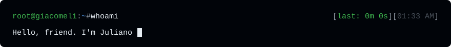

AI/ML engineer and tech lead building **agents**, **LLM
(Large Language Model) infrastructure** and **RAG (Retrieval-Augmented
Generation) pipelines**, on top of two decades shipping production
software. I've been taking things apart since I was a kid soldering
circuits at age 10, long before my first professional line of code
back in 2004.

I lead a development team in Curitiba, Brazil, where I coordinate
the architecture and make the technical calls on how we build an
AI-powered ecosystem that integrates marketplace, ERP and CRM. It
runs in production on **.NET**, **Laravel**,
**React/Next.js (TypeScript)**, **AWS** and **Python**.

---

#### What I'm working on

**Agents, LLM infra & RAG**: orchestration, retrieval pipelines and
the unglamorous plumbing that makes language models actually useful
in production: evaluation, guardrails, cost control, and knowing when
*not* to use an LLM.

**Deep learning for medical signal processing** *(research)*:
training models for electrocardiogram (ECG) diagnosis. Beyond the
common diagnostic classes, the current frontier is detecting
STEMI (ST-Elevation Myocardial Infarction) and OMI (Occlusion
Myocardial Infarction), the cases where minutes decide outcomes
and the classic criteria fail the most. That's the *what*; the
*how* stays in the lab for now. News soon.

**CNN1D + Mamba (SSM, State Space Model) for images**: exploring
sequence-first architectures applied to image data: treating images
as 1D scans and letting selective state spaces do the spatial
reasoning that convolutions and attention usually monopolize.

**[SimpleMapper](https://github.com/giacomeli/SimpleMapper)**: a
zero-configuration object mapper for .NET. Compiled Expression Trees,
thread-safe cache, convention over configuration. Born from a simple
frustration: mapping code is the most boring code we write, so it
should require the least effort. Battle-tested in a full production
codebase, not just benchmarks.

---

#### How I think about engineering

- **Convention over configuration.** Every knob you expose is a
  decision you're outsourcing to someone with less context than you.
- **Boring in production, curious everywhere else.** The stack that
  pays the bills should be predictable; the home lab is where the
  weird ideas go.
- **Depth transfers.** Understanding how something works one layer
  below where you operate is the highest-leverage skill I know.

---

#### Off the keyboard

Self-taught in most things I do: electronics, mechanics, digital
painting, and multiple musical instruments. Give me something broken
(an engine, an amplifier, a model that won't converge) and I'm happy.
I'm convinced the habit of learning things from zero is the actual
job skill; everything else is syntax.

---

*Curitiba, PR, Brazil*
